# 🚀 Deployment della piattaforma

Questa guida descrive i passaggi per effettuare il deploy dell'applicazione **CoWorkSpace** su diversi ambienti.

## 🌱 Sviluppo
Esegui l'applicazione in locale con Docker o `npm start` per il backend. Utilizza un database locale e copia il file `backend/.env.example` in `.env` impostando valori adatti allo sviluppo.

## 🧪 Staging
Ambiente intermedio per testare le release prima della produzione. Le immagini Docker sono taggate come `staging` e le variabili sono gestite tramite Parameter Store o Secrets Manager dedicati.

## 🚢 Produzione

### 🏗️ Provisioning infrastruttura
Provisionare manualmente i servizi necessari su AWS tramite CLI:

1. **ECR** – creare il repository delle immagini Docker e autenticarsi:
   ```bash
   aws ecr create-repository --repository-name coworkspace
   aws ecr get-login-password --region <regione> \
     | docker login --username AWS --password-stdin <account>.dkr.ecr.<regione>.amazonaws.com
   ```
2. **S3** – creare un bucket per asset statici o backup:
   ```bash
   aws s3api create-bucket --bucket coworkspace-assets --region <regione> \
     --create-bucket-configuration LocationConstraint=<regione>
   ```
3. **RDS** – avviare l'istanza PostgreSQL:
   ```bash
   aws rds create-db-instance --db-instance-identifier coworkspace-db \
     --engine postgres --master-username <user> --master-user-password <password> \
     --allocated-storage 20 --db-instance-class db.t3.micro
   ```
4. **ECS** – creare il cluster e il servizio:
   ```bash
   aws ecs create-cluster --cluster-name coworkspace
   # registrare una task definition e creare il servizio
   aws ecs register-task-definition --cli-input-json file://task-definition.json
   aws ecs create-service --cluster coworkspace --service-name coworkspace-api \
     --task-definition coworkspace-api --desired-count 1
   ```

### 📦 Build e push dell'immagine Docker
1. Eseguire il login al repository ECR:
   ```bash
   aws ecr get-login-password --region <regione> \
     | docker login --username AWS --password-stdin <account>.dkr.ecr.<regione>.amazonaws.com
   ```
2. Costruire l'immagine backend (aggiornare il tag a seconda della release):
   ```bash
   docker build -t <account>.dkr.ecr.<regione>.amazonaws.com/coworkspace/backend:latest ./backend
   ```
3. Effettuare il push dell'immagine su ECR:
   ```bash
   docker push <account>.dkr.ecr.<regione>.amazonaws.com/coworkspace/backend:latest
   ```
4. In alternativa, utilizzare il workflow CI/CD configurato su GitHub Actions che esegue automaticamente build e push ad ogni tag.

### 🔐 Variabili d'ambiente e segreti
Archivia le credenziali in **AWS Systems Manager Parameter Store** o **Secrets Manager** invece di inserirle in chiaro nelle impostazioni di ECS/EC2. Il file `backend/.env.example` elenca tutte le variabili supportate; la tabella seguente riassume le differenze tra ambienti principali.

| Variabile | Sviluppo | Staging | Produzione |
|-----------|----------|---------|-----------|
| `DB_HOST` | `localhost` | endpoint RDS di staging | endpoint RDS di produzione |
| `JWT_SECRET` | valore di test | parametro SSM `/staging/JWT_SECRET` | parametro SSM `/coworkspace/JWT_SECRET` |
| `STRIPE_SECRET_KEY` | chiave test sandbox | chiave test su Secrets Manager | chiave live su Secrets Manager |

Esempio di creazione di un parametro protetto:

```bash
aws ssm put-parameter \
  --name /coworkspace/JWT_SECRET \
  --value 'supersegreto' \
  --type SecureString
```

Per leggerlo da un'istanza EC2:

```bash
aws ssm get-parameter \
  --name /coworkspace/JWT_SECRET \
  --with-decryption \
  --query 'Parameter.Value' \
  --output text
```

Nella **task definition** ECS usa la sezione `secrets` per collegare Parametri/Secrets alla container definition:

```json
"secrets": [
  { "name": "JWT_SECRET", "valueFrom": "arn:aws:ssm:<REGION>:<ACCOUNT_ID>:parameter/coworkspace/JWT_SECRET" },
  { "name": "DATABASE_URL", "valueFrom": "arn:aws:ssm:<REGION>:<ACCOUNT_ID>:parameter/coworkspace/DATABASE_URL" },
  { "name": "STRIPE_SECRET_KEY", "valueFrom": "arn:aws:secretsmanager:<REGION>:<ACCOUNT_ID>:secret:stripe-key" }
]
```

Variabili richieste: `JWT_SECRET`, `DATABASE_URL`, `STRIPE_SECRET_KEY` e le altre definite in `backend/.env.example`. Impostarle recuperando i valori dai servizi segreti dell'ambiente specifico così che non vengano mai salvati in chiaro né commitati nel repository.

### 🔁 Rollback delle release e snapshot RDS
1. Prima di ogni rilascio, creare uno **snapshot manuale** dell'istanza RDS:
   ```bash
   aws rds create-db-snapshot --db-instance-identifier <istanza> --db-snapshot-identifier <snapshot>
   ```
2. In caso di problemi post-deploy:
   - **Revert del tag Docker** aggiornando il servizio ECS all'immagine precedente.
   - **Annullare le migrazioni** del database utilizzando lo strumento di migrazione adottato (es. `npm run migrate:undo`).
   - **Ripristinare le configurazioni** riprendendo le variabili d'ambiente o i file di configurazione dalla versione precedente.
   - Ripristinare l'istanza dal punto di snapshot:
     ```bash
     aws rds restore-db-instance-from-db-snapshot --db-instance-identifier <nuova-istanza> --db-snapshot-identifier <snapshot>
     ```
   - Aggiornare l'endpoint del database nell'applicazione.
3. Valutare l'uso dei **backup automatici** per il ripristino point-in-time.

Seguendo questi passaggi è possibile eseguire un deploy sicuro e ripristinare rapidamente l'ambiente in caso di necessità.

### 🌐 Distribuzione frontend statico con S3 + CloudFront

1. Carica i file statici del frontend nel bucket S3.
2. Abilita "Static website hosting" nelle proprietà del bucket.
3. Crea una distribuzione CloudFront con origine il bucket S3 (website endpoint).
4. Aggiorna la policy del bucket per permettere l’accesso pubblico ai file statici.
5. Invalida la cache CloudFront dopo ogni deploy del frontend.

### 🔄 Esempio di flusso CI/CD
Un flusso tipico prevede:

```mermaid
flowchart LR
  A[Commit su main] --> B[Test e build]
  B --> C[Push immagine su ECR]
  C --> D[Deploy su Staging]
  D --> E{Approvo?}
  E -->|Sì| F[Deploy su Produzione]
```



In alternativa puoi descriverlo come: push del codice ➜ esecuzione dei test ➜ build e push dell'immagine ➜ deploy automatico in staging ➜ approvazione manuale per la produzione.
